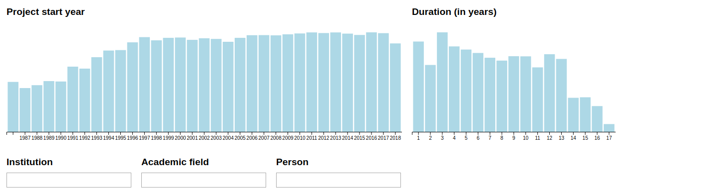
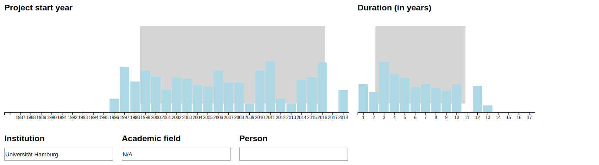
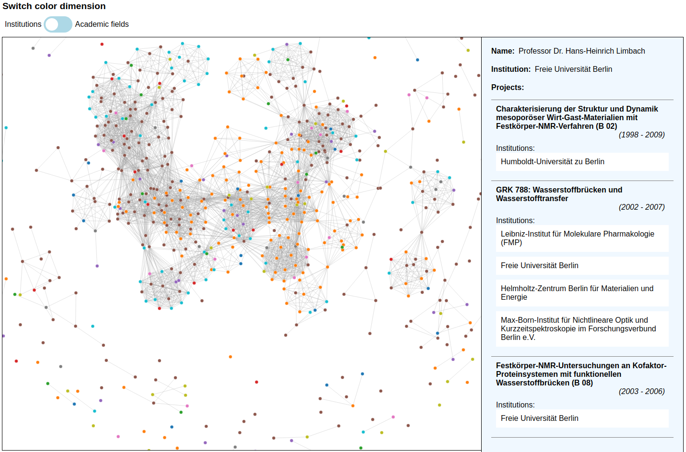

- [x] Project name. The name of the visualization should be the first thing people see.
- [ ] Short description: Goal of the visualization in one sentence.
- [ ] Table of contents (TOC): If the README is longer than a page, use a TOC to navigate between the subsections of the page.
- [ ] Project description: The description of the project should not be too extensive but help people understand the project and your design decisions in detail. Describe the idea behind the visualization project, the target group, and what its functionality is (e.g., interaction). Please complete this description with said design decisions as stated above. Do not forget to describe external data sources you used, and mention libraries you used in addition to d3.js.
- [ ] Installation: How can I install the visualization project (step-by-step manual)?
- [ ] Manual: A brief manual about how to use the software. For this it makes sense to use screencasts or screenshots.
- [x] Contributors: Name your group members here and add links to their (Github) profiles.
- [x] Data copyright: Add the comment “Data derived from original data provided by https://gepris.dfg.de (c) Deutsche Forschungsgemeinschaft”

# Visualization tool for exploring network connections in the DFG data

We build a visualization tool with d3 for exploring connections from scientist in the DFG data (Deutsche Forschungsgemeinschaft) including multiple filtering options for the user.  

## Installation

1. In folder "/d3" install dependencies with command: `npm i`
2. Start server with `npx http-server .`

## Project description

__Domain problem characterization: Describe the domain situation, i.e., what is the group of target users, their domain of interest, their questions, and their data.__

Lorem ipsum dolor sit amet, consetetur sadipscing elitr, sed diam nonumy eirmod tempor invidunt ut labore et dolore magna aliquyam erat, sed diam voluptua. At vero eos et accusam et justo duo dolores et ea rebum. Stet clita kasd gubergren, no sea takimata sanctus est Lorem ipsum dolor sit amet. Lorem ipsum dolor sit amet, consetetur sadipscing elitr, sed diam nonumy eirmod tempor invidunt ut labore et dolore magna aliquyam erat, sed diam voluptua. At vero eos et accusam et justo duo dolores et ea rebum. Stet clita kasd gubergren, no sea takimata sanctus est Lorem ipsum dolor sit amet.

__Data / task abstraction: Formulate the tasks in a domain-independent vocabulary. How did you prepare (aggregate, filter...) the data to support the tasks?__

Lorem ipsum dolor sit amet, consetetur sadipscing elitr, sed diam nonumy eirmod tempor invidunt ut labore et dolore magna aliquyam erat, sed diam voluptua. At vero eos et accusam et justo duo dolores et ea rebum. Stet clita kasd gubergren, no sea takimata sanctus est Lorem ipsum dolor sit amet. Lorem ipsum dolor sit amet, consetetur sadipscing elitr, sed diam nonumy eirmod tempor invidunt ut labore et dolore magna aliquyam erat, sed diam voluptua. At vero eos et accusam et justo duo dolores et ea rebum. Stet clita kasd gubergren, no sea takimata sanctus est Lorem ipsum dolor sit amet.

__Visual encoding / interaction design: Describe the visual encoding and why you decided for it. What interaction types did you use and why?__  

Lorem ipsum dolor sit amet, consetetur sadipscing elitr, sed diam nonumy eirmod tempor invidunt ut labore et dolore magna aliquyam erat, sed diam voluptua. At vero eos et accusam et justo duo dolores et ea rebum. Stet clita kasd gubergren, no sea takimata sanctus est Lorem ipsum dolor sit amet. Lorem ipsum dolor sit amet, consetetur sadipscing elitr, sed diam nonumy eirmod tempor invidunt ut labore et dolore magna aliquyam erat, sed diam voluptua. At vero eos et accusam et justo duo dolores et ea rebum. Stet clita kasd gubergren, no sea takimata sanctus est Lorem ipsum dolor sit amet.

__Algorithm design: How did you make sure that the computational complexity of your solution is appropriate? What is the bottleneck with respect to performance?__

Lorem ipsum dolor sit amet, consetetur sadipscing elitr, sed diam nonumy eirmod tempor invidunt ut labore et dolore magna aliquyam erat, sed diam voluptua. At vero eos et accusam et justo duo dolores et ea rebum. Stet clita kasd gubergren, no sea takimata sanctus est Lorem ipsum dolor sit amet. Lorem ipsum dolor sit amet, consetetur sadipscing elitr, sed diam nonumy eirmod tempor invidunt ut labore et dolore magna aliquyam erat, sed diam voluptua. At vero eos et accusam et justo duo dolores et ea rebum. Stet clita kasd gubergren, no sea takimata sanctus est Lorem ipsum dolor sit amet.

## Manual

The visualization tool is structured in two main areas: the filtering and the exploring area.   

__1. filtering area:__

In the filter area there are filter options in five different dimensions: "Project start year", "Duration (in years)", "Institution", "Academic field" and "Person".

For filtering the dimensions "Project start year" and "Duration (in years)" you have to select an interval in the bar charts. The dimensions "Institution", "Academic field" and "Person" can be filtered by the text fields which support autocompletion and drop down features. Deselection is possible by clicking onto a bar chart or removing the text by the text fields. The filter (bar charts and autocomplition) adjust and show only the data which match to the selected filter. Here you can see an example filter and the resulting bar charts:      

__2. exploring area:__

In the exploring area the network graph will be shown if the selected filter data include less than 1000 persons (due to performance reasons). If more than the required persons are selected you will see the following message:  

If in the filtered data are less than 1000 persons the network graph for the specific filter will be shown. Here you can see an example graph for all persons who worked in projects of the "Freie Universität Berlin":

Every node represent one person and the links between nodes will be drawn if persons worked together in a project. The width of the links encode the amount of projects they have worked together. The user can zoom into the graph and navigate via mouse. If he hovers over a node informations of this person will be displayed on the right side. This inforamtions includes the name of the person, the institution for which the person is working and a list of all projects the person worked in. The informations for a project includes the project name, the start and end year, if present the subject area and all institutions which where involve to this project.     

## Data

Data derived from original data provided by https://gepris.dfg.de (c) Deutsche Forschungsgemeinschaft

## Contributors

- Nils Hutmacher (https://github.com/Nilshut)
- Iason Simlag (https://github.com/iasonAdvAlg)
