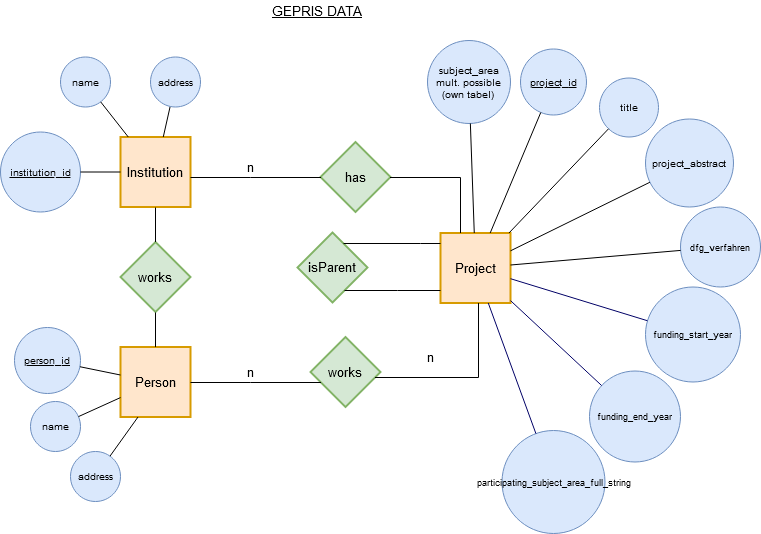

# data-vis-project3

## Installation

1. In folder "d3" install dependencies with command: `npm i`
2. Start server with `npx http-server .`

## Data

## TODO

- adjust new csv's and filter procedure:
  - from filter method get project_ids -> from project_ids get all participating person_id's (persons_projects.csv) -> dont use links.csv, calc connections (same projects = connection)
- add subject filter (subject_data.csv)
- fix filter_bar legend:
  - duration ordered by int (not string)
  - universities, maybe only show top 20 and show institution_name
- change colorScale of forced graph by a button (or something similar): institution_name and subject
- implement a filter function for person_name or person_id:
  - show n'th connections relative to selected person, may use links.csv in this case
